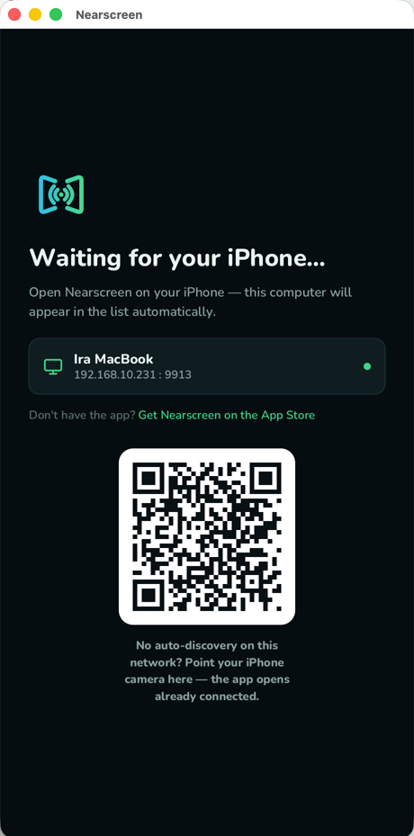
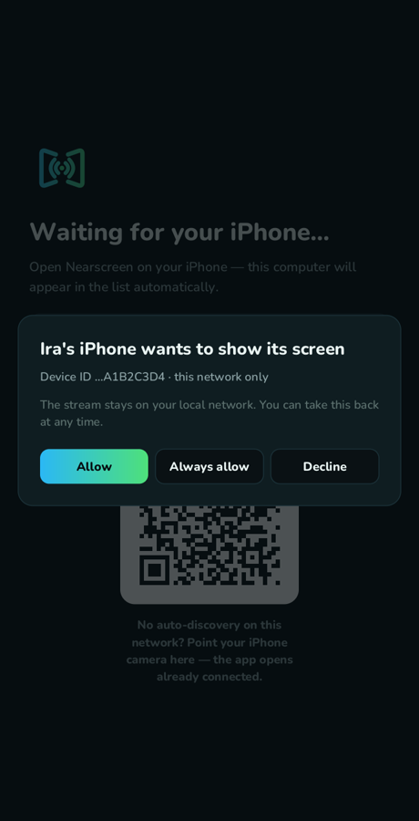
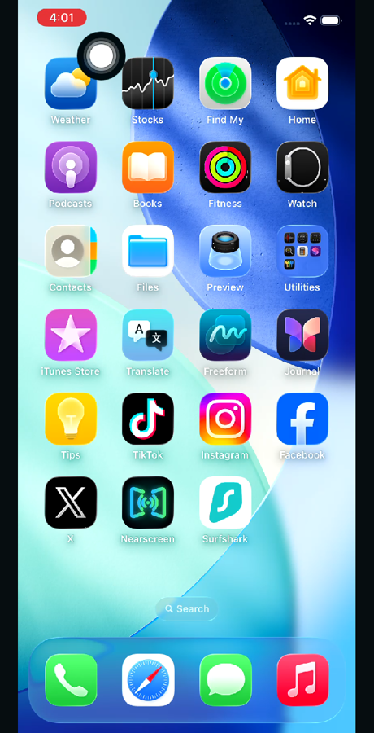

# Nearscreen Receiver

Show your iPhone screen on your computer — over your own Wi-Fi, and nothing
else. This is the desktop receiver for the
[Nearscreen iOS app]([APP STORE URL]).

**Open source on purpose.** Nearscreen's whole promise is that your screen
never leaves your local network. You don't have to take our word for it —
this receiver is all the code that ever touches your video, and you're
looking at it.

| Waiting for a phone (macOS) | The first time one connects (Windows) | Streaming (Windows) |
|---|---|---|
|  |  |  |

## Quick start

1. **Download** the receiver for
   [Windows](https://github.com/nearscreen/receiver/releases/latest) or
   [macOS](https://github.com/nearscreen/receiver/releases/latest) and run it.
   Windows asks once to allow it on your private network — click *Allow*.
   macOS asks once for permission to talk to devices on your local network.

   The Mac build is not notarised yet, so the first launch needs
   Control-click → *Open* rather than a double click. That changes as soon as
   the project has an Apple Developer certificate; nothing about the app
   changes with it.
2. **Install Nearscreen** on your iPhone from the
   [App Store]([APP STORE URL]).
3. Open the app — your computer shows up by name. Tap the big button,
   choose **Start Broadcast**, and your screen appears in the window.

On a network that blocks device discovery (offices, dorms, guest Wi-Fi):
point your iPhone camera at the QR code in the receiver window — the app
opens already connected.

## How it works

- The receiver advertises itself via mDNS (`_nearscreen._tcp`, TCP port 9913)
  using a built-in responder — nothing to install, no Apple Bonjour needed.
- The phone connects directly over TCP and streams hardware-encoded
  H.264/HEVC. The wire format is documented in [PROTOCOL.md](PROTOCOL.md).
- The first time a phone connects you're asked to accept it. Approved phones
  are remembered.
- The receiver makes **no outbound connections**. No cloud, no telemetry,
  no update checks. Grep the source.

## When your network hides devices from each other

Guest Wi-Fi, dorms and many office networks block the discovery traffic that
lets the phone find this computer. The receiver's window shows a QR code for
exactly this: point the iPhone camera at it and the app opens already
pointed at this computer.

## Capture it in OBS

The video window keeps a stable title (`Nearscreen — iPhone (…)`), so a
regular *Window Capture* source just works. A borderless mode is available
from the tray icon for a clean frame.

## Building from source

```
cargo build --release
```

Rust stable; video is decoded by the OS (Media Foundation on Windows,
VideoToolbox on macOS) — no external media libraries.

## License

MIT. The wire protocol is open — third-party receivers are welcome.
